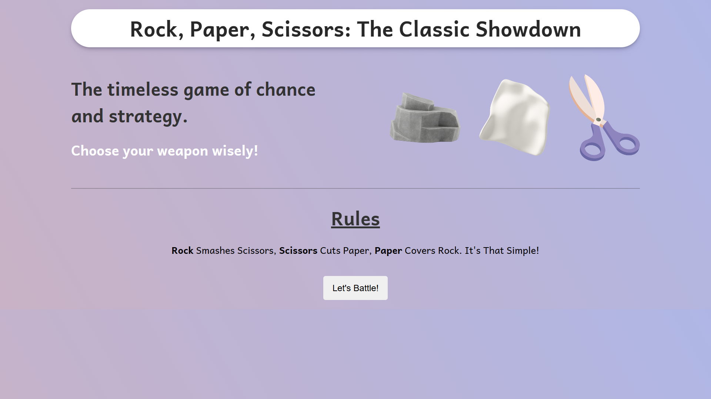
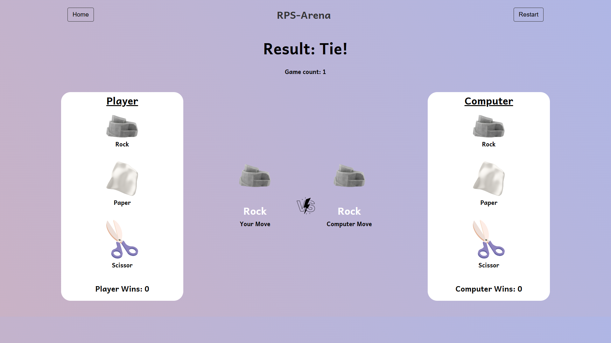

# RPS-Battleground

**RPS-Battleground** is a web-based game that brings a competitive twist to the classic Rock-Paper-Scissors game. Players can engage in multiple rounds, track their scores, and enjoy an enhanced UI that makes the game more interactive and fun.

## Screenshots

### Home Screen


### In-Game Screen


## Features

- **Classic Gameplay:** Rock beats Scissors, Scissors beat Paper, and Paper beats Rock.
- **Score Tracking:** Keep track of your wins, losses, and ties.
- **Responsive Design:** Enjoy the game on both desktop and mobile devices.
- **Interactive UI:** A sleek and modern user interface with animations for a more engaging experience.
- **Built with React:** The game is built using React.js, providing a seamless and efficient user experience.

## Installation

To run this project locally, follow these steps:

1. **Clone the repository:**
   ```bash
   git clone https://github.com/Janaharan/RPS-Battleground.git
